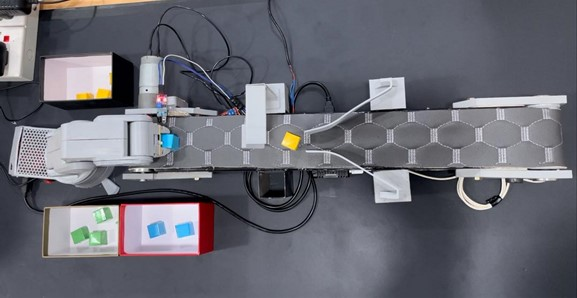
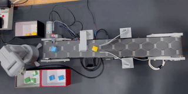
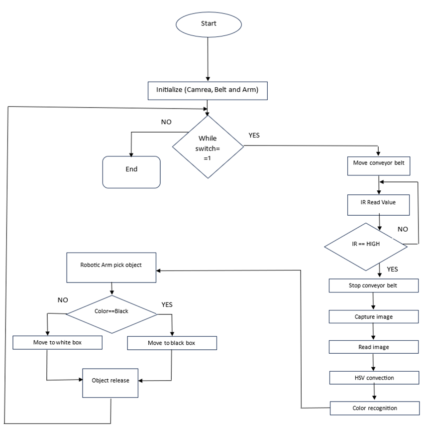
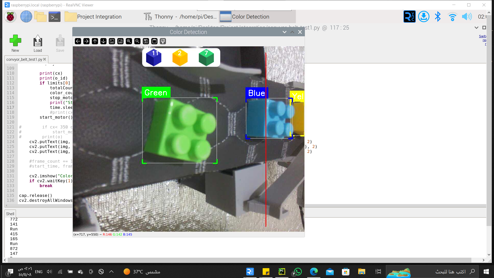
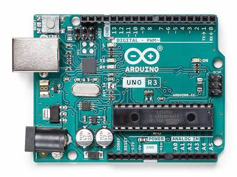
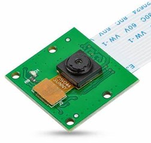
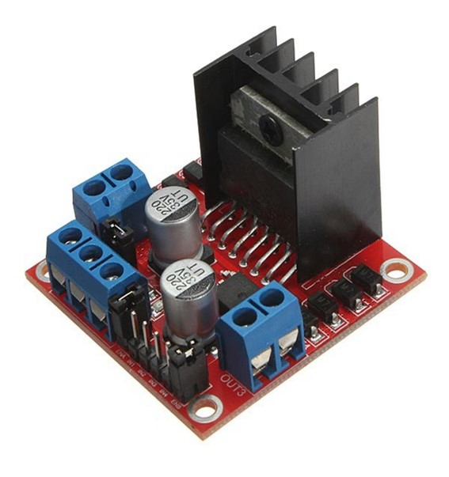
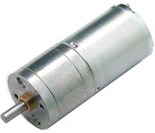
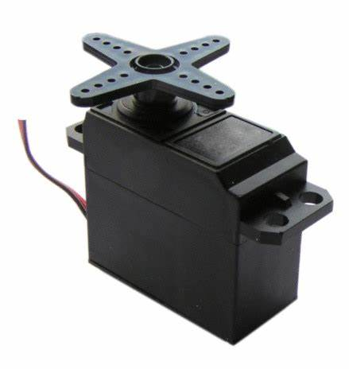

# 🎨🤖 Color-Based Sorting Robot  

A **smart automation system** that uses **computer vision and robotics** to detect and sort objects based on their color. This project integrates **Raspberry Pi, OpenCV, and a robotic arm** to enhance industrial automation by improving sorting accuracy and reducing manual labor.  

 
---

## 🚀 Features  
✅ **Real-time Color Detection** – Uses **OpenCV and a camera** to recognize colors.  
✅ **Automated Sorting** – A robotic arm sorts objects into bins based on color.  
✅ **Conveyor Belt System** – Moves objects for continuous sorting.  
✅ **Microcontroller Integration** – Powered by **Raspberry Pi & Arduino** for control.  
✅ **Efficient & Scalable** – Designed for **industrial and educational applications**.  

---

## 🎥 Demo & Project Overview  

### 📌 System Overview  
The system consists of:  
- A **conveyor belt** to transport objects  
- A **camera (Arducam) & OpenCV** for color detection  
- A **Raspberry Pi 4** for processing  
- An **Arduino-controlled robotic arm** for object sorting  

 
## 🎥 Demo GIF  

---

### 📌 Working Process  
1️⃣ **Object is placed on the conveyor belt**  
2️⃣ **Camera captures an image & detects color using OpenCV**  
3️⃣ **Raspberry Pi processes the image & determines sorting category**  
4️⃣ **Robotic arm picks & places the object in the correct bin**  

  

---

### 📌 Color Recognition in Action  
The system classifies objects into ** Green, Blue, and Yellow** bins based on **HSV color space processing** in OpenCV.  

  

---

## 🛠️ Hardware & Software Used  

### 🔹 Hardware Components  
- 🎯 **Raspberry Pi 4** – Main processing unit  

- 🎯 **Arduino Uno** – Controls robotic arm  

- 🎯 **Arducam Camera Module** – Captures object images
   

- 🎯 **L298N Motor Driver** – Controls motors  
 

- 🎯 **12V Gear-box Motor** – Moves conveyer belt
 

- 🎯 **Servo Motors** – Moves robotic arm  
 

- 🎯 **Conveyor Belt System** – Transports objects
-   

 
### 🔹 Software & Libraries  
- 🖥️ **Python & OpenCV** – Image processing & color detection  
- 🖥️ **KivyMD** – App interface for monitoring  
- 🖥️ **Arduino IDE** – Microcontroller programming  
- 🖥️ **Thonny IDE** – Microprocessor programming  
- 🖥️ **SolidWorks** – Mechanical design  

